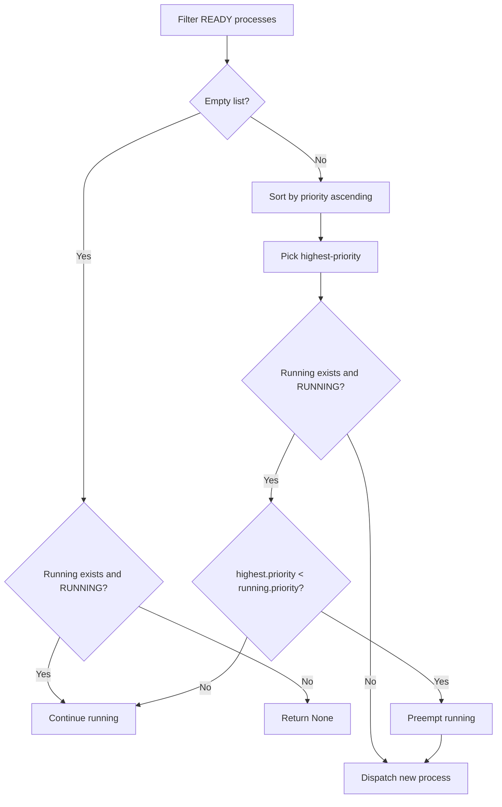

# Schedulers You Can Compare (Algorithms and Parameters)

The simulator lets you plug in different CPU scheduling strategies and compare their performance on synthetic workloads. Each scheduler implements a common interface (`addProcess`, `removeProcess`, `getNextProcess`, and optionally `onTickEnd`) consumed by the core `CPUSimulator` loop. Below is an in-depth look at the **Priority** scheduler, covering how it interprets numeric priority values, maintains its ready queue, and decides when to preempt a running process.

## Priority Scheduling: Preemption Rule and Priority Meaning 🎯

Priority scheduling assigns each process a numeric priority; **lower** numbers correspond to **higher** urgency. This implementation is **preemptive**, meaning a running process can be interrupted if a newly ready process has a strictly higher priority (i.e., a smaller number).

### How Priority Values Are Assigned

- Each `Process` carries a `priority` attribute assigned at generation time.
- Workload generators use `randint(1, 5)` to pick priorities in the range **1** (highest) to **5** (lowest) .
- The `Process` class simply stores that integer without further transformation .

### Core Components

| Component | Responsibility |
| --- | --- |
| **readyProcesses** | Internal list of all processes in **READY** state |
| **addProcess(p)** | Appends `p` to `readyProcesses` if not already present |
| **removeProcess(p)** | Removes `p` from `readyProcesses` if present |
| **getNextProcess** | Picks the next process to run based on priority and preemption |
| **onTickEnd** | No-op for this scheduler |


### Scheduling Decision Logic

```python
def getNextProcess(self, running, time):
    ready = [p for p in self.readyProcesses if p.state == "READY"]
    if not ready:
        return running if running and running.state == "RUNNING" else None

    # Sort READY queue: lower priority number first
    ready.sort(key=lambda x: x.priority)
    highest = ready[0]

    if running and running.state == "RUNNING":
        # Preempt if new process has strictly higher priority
        if highest.priority < running.priority:
            if running not in self.readyProcesses:
                running.state = "READY"
                self.readyProcesses.append(running)
            self.readyProcesses.remove(highest)
            return highest
        else:
            return running
    else:
        # No current runner → dispatch highest-priority
        self.readyProcesses.remove(highest)
        return highest
```

*Excerpted and adapted from `Schedulers.py`*

1. **Filter** the internal queue to processes whose `state == "READY"`.
2. **Sort** by the `priority` attribute (ascending).
3. If **no ready** processes exist, the scheduler either continues running the current process or idles.
4. If a process **is running**, compare its priority to the head of the ready list:
5. If the new process’s priority is **strictly higher** (`<`), **preempt**.
6. Otherwise, let the current process continue.
7. If **no process** is running, **dispatch** the highest-priority process.

### Preemption Flowchart



### Integration with `CPUSimulator`

- On each **tick**, `CPUSimulator` calls:
- **Arrival/IO handling**: new or unblocked processes are marked **READY** and fed to `addProcess`.
- **Scheduler invocation**:

```python
     running = scheduler.getNextProcess(running, time)
     if running:
         running.state = "RUNNING"
         # decrement remaining_time, handle I/O, termination...
     scheduler.onTickEnd(running, time)
```

- When a running process is preempted, it re-enters the **readyProcesses** list with its `state` reset to **READY**, ensuring it can be scheduled again later .

### Priority Scheduler at a Glance

| Feature | Behavior |
| --- | --- |
| Priority Range | 1 (highest) … 5 (lowest) |
| Preemptive | Yes |
| Ready-Queue Structure | Flat list sorted on each dispatch |
| Time Complexity (per tick) | O(n log n) for sorting; n = number of READY processes |
| Workload Generation Source | `ProcessGenerate.py` via `randint(1,5)` |


```card
{
    "title": "Key Takeaway",
    "content": "Lower numeric priority values run first; a running job can be preempted if a higher-priority job arrives."
}
```

With this setup, you can observe how priority-driven preemption impacts **average waiting**, **response**, and **turnaround** times compared to other scheduling strategies.